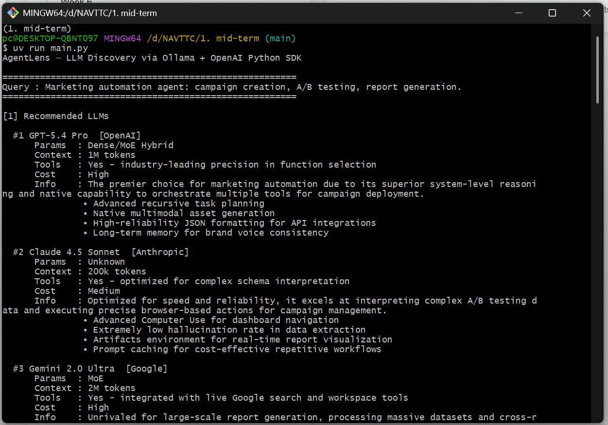

# 🕵️‍♂️ AgentLens

**AgentLens** is a state-of-the-art agentic AI tool designed to discover and recommend the best Large Language Models (LLMs) for specific workflows. Powered by **Ollama** and the **OpenAI Python SDK**, it uses native tool-calling to browse the web for the latest 2026 benchmarks and releases.

---

## 🚀 Features

-   **Agentic Reasoning**: Doesn't just guess—it researches. The agent autonomously decides if it needs to browse the web for up-to-date information.
-   **Native Tool Calling**: Implements true functional tool-calling (`web_search`) using the latest OpenAI/Ollama implementation patterns.
-   **2026 Flagship Support**: Optimized to recommend the newest models:
    *   **OpenAI**: GPT-5.4 Thinking / Pro
    *   **Google**: Gemini 3.1 Pro (1M Context)
    *   **Anthropic**: Claude 4.6 Sonnet / Opus
-   **Local & Cloud Hybrid**: Built to run through a local **Ollama** instance while discovering best-in-class cloud models.
-   **Clean CLI**: Simple, formatted output for immediate analysis.

---

## 🛠️ Tech Stack

-   **Python 3.11+**
-   **Ollama**: Local model hosting and OpenAI-compatible API.
-   **OpenAI SDK**: Modern tool-calling and chat completion management.
-   **DDGS**: Advanced web-searching without API keys.
-   **UV**: Blazing fast project and dependency management.

---

## 📦 Installation

This project uses `uv` for seamless setup:

```bash
# 1. Install dependencies
uv sync

# 2. Configure environment
# Copy .env.example to .env and ensure OLLAMA_BASE_URL is correct
cp .env.example .env
```

---

## 🏃‍♂️ Usage

Run the discovery agent:

```bash
uv run main.py
```

### CLI Demo


### How it works:
1.  **Request**: You provide a workflow description (e.g., "Marketing Automation Agent").
2.  **Autonomous Search**: AgentLens recognizes if it needs the web.
3.  **Tool Execution**: It calls `web_search` to find latest 2026 release info.
4.  **Recommendation**: It returns a clean JSON-parsed list of the best 5-6 models ranked by suitability.

---

## 📂 Project Structure

-   `main.py`: Entry point for the CLI.
-   `agent_core.py`: The brain of the agent—handles tool-calling loops and API interaction.
-   `config.py`: System prompts and LLM configurations.
-   `.env`: Environment variables for your Ollama instance.

---

## 📜 License
MIT

## Author
Muhammad Aliyan
